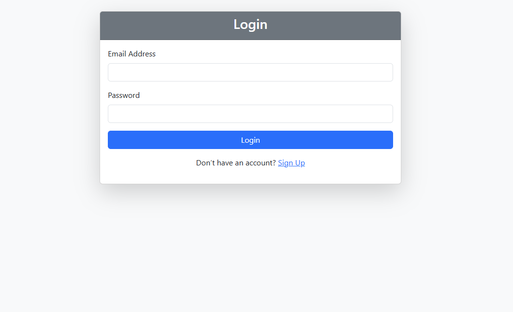
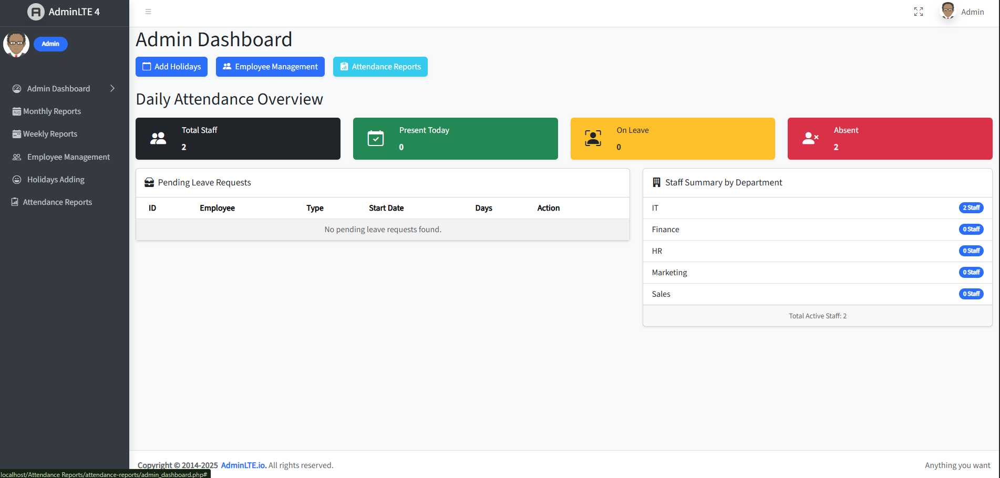
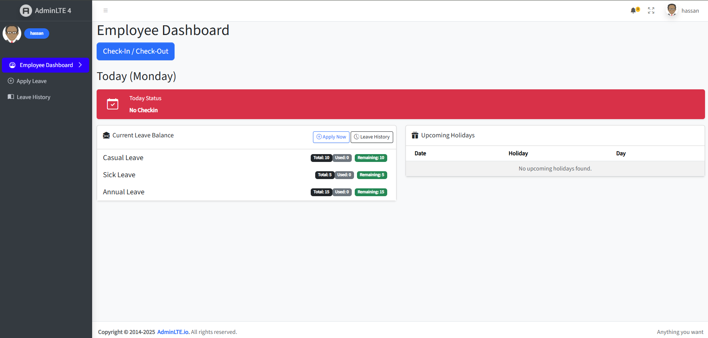
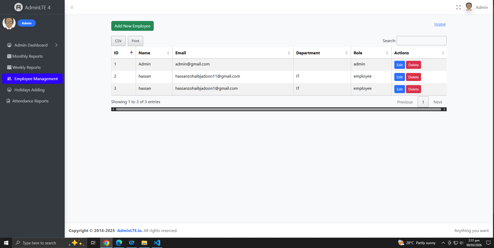
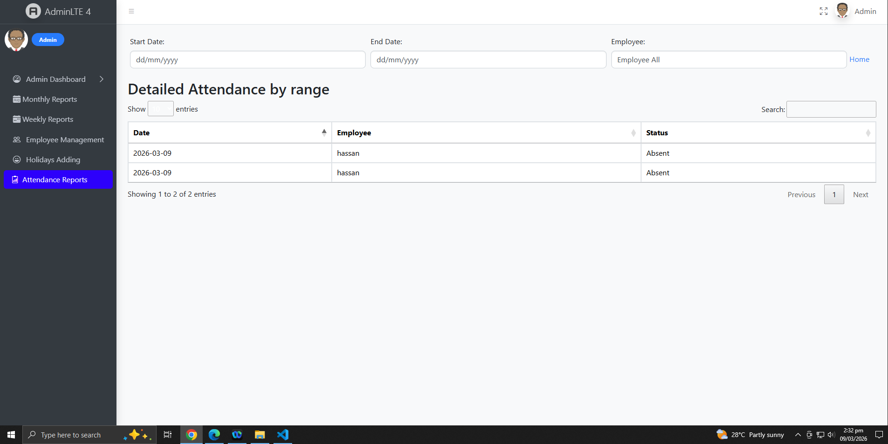
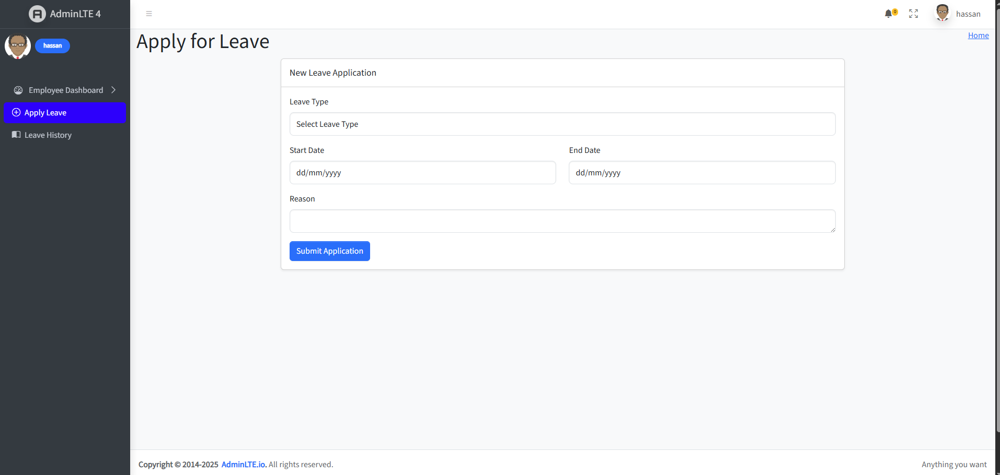
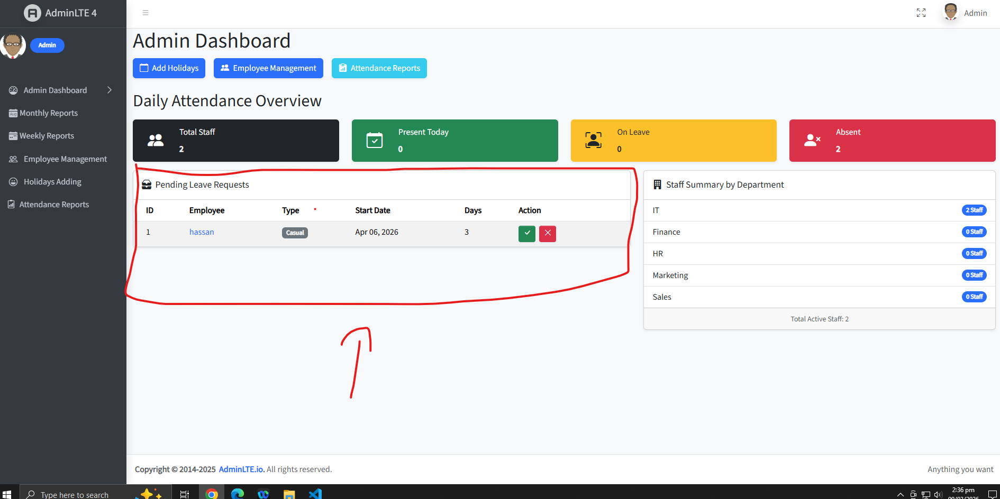
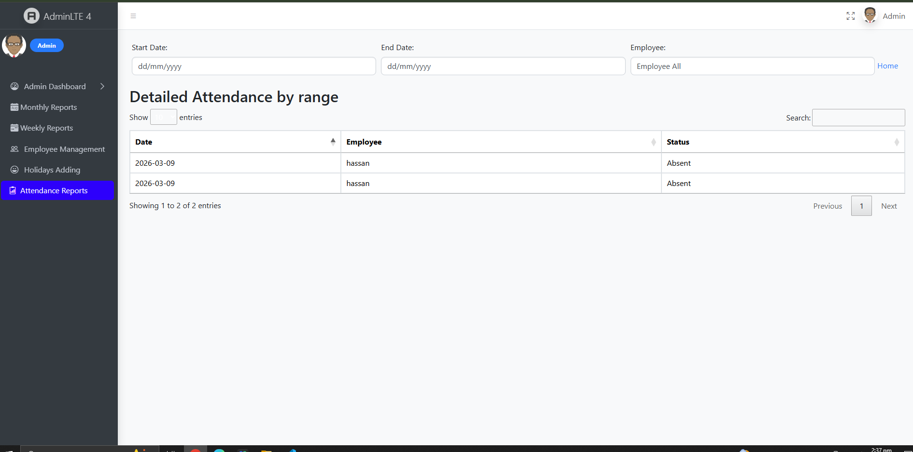
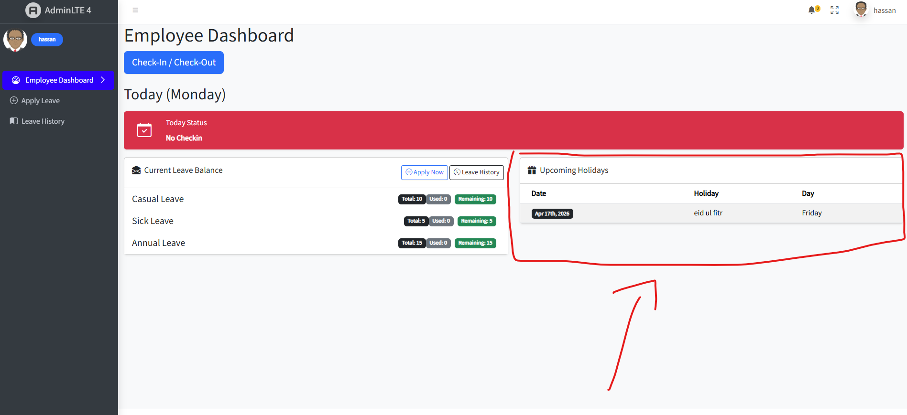

# Attendance and Leave Management System

A web-based **Attendance and Leave Management System** developed using **PHP, MySQL, and AdminLTE**.
The system helps organizations manage **employee attendance, leave requests, holidays, and reports** efficiently.

Employees can mark their attendance, request leave, and track their records, while administrators can manage employees, approve or reject leave requests, and generate attendance reports.

---

# Key Features

## User Authentication

- Secure login system using PHP sessions
- Password encryption using `password_hash()`
- Role-based access control:
  - **Admin**
  - **Employee**

---

## Dashboard

### Admin Dashboard

- View total employees
- Daily attendance statistics
- Pending leave requests
- Department summary

### Employee Dashboard

- Attendance summary
- Leave balance
- Upcoming holidays
- Personal attendance history

---

## Employee Management (Admin)

Admin can manage employees:

- Add new employees
- Edit employee information
- Delete employees
- Assign departments and roles
- Store joining date
- Export employee list to CSV

---

## Attendance Management

Employees can record attendance through **Check In / Check Out**.

Features include:

- Timestamp recording
- Attendance status:
  - Present
  - Absent
  - Late

- Prevent multiple check-ins on the same day
- Daily / Weekly / Monthly attendance tracking
- Attendance reports
- Export attendance reports to **CSV or PDF**

---

## Leave Management

Employees can apply for leave directly from the system.

Supported leave types:

- Casual Leave
- Sick Leave
- Earned Leave

Admin can:

- Approve leave requests
- Reject leave requests
- Track employee leave balance
- View leave history (Approved / Pending / Rejected)

---

## Email Notifications

When a leave request is **approved or rejected**, the system automatically sends an **email notification** to the employee informing them about the decision.

This keeps employees informed about the status of their leave requests.

---

## Holidays / Off Days

Admin can manage company holidays.

Features:

- Add public holidays
- Configure weekly off days
- Automatically mark holidays as **Off Day** in attendance
- Display upcoming holidays to employees

---

## Reports

The system provides detailed reports including:

- Attendance report by employee
- Attendance report by date range
- Leave usage report
- Department-wise attendance summary
- Export reports as **PDF or Excel**

---

## System Settings

Admin can configure:

- Working hours
- Late check-in rules
- Leave policies
- Leave quotas

---

# Technologies Used

Frontend

- HTML
- CSS
- Bootstrap
- AdminLTE
- JavaScript
- jQuery

Backend

- PHP

Database

- MySQL

---

# Default Login Credentials

## Admin Login

Email
[admin@gmail.com](mailto:admin@gmail.com)

Password
123456

---

## Employee Login

Email
[employee@gmail.com](mailto:employee@gmail.com)

Password
123456

---

# Project Structure

attendance-reports

admin
employee
assets
includes
screenshots
README.md

---

# Screenshots

### Login Page

### Admin Dashboard

### Employee Dashboard

### Employee Management

### Attendance Records

### Leave Request

### Leave Approval

### Attendance Report

### Holidays

---

# Author

Hassan Zohaib Jadoon
Junior Web Developer

GitHub
https://github.com/HassanZohaibJadooni

## Screenshots

### Login Page

### Admin Dashboard

### Employee Dashboard

### Employee Management

### Attendance Record

### Leave Request

### Leave Approval

### Attendance Report

### Holidays / Off Days

